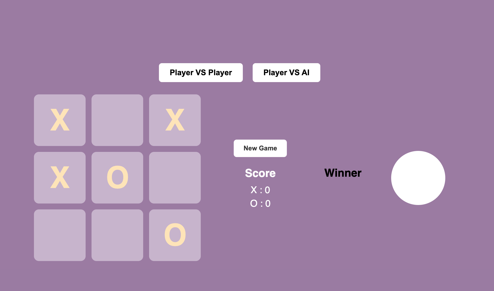

🎮 Tic-Tac-Toe Game

A Modern Web-Based Game | Player vs Player & Player vs AI

📌 Overview

This is an interactive and visually appealing Tic-Tac-Toe web application built using HTML, CSS, and JavaScript.
The game supports both:

👥 Player vs Player (PvP)

🤖 Player vs AI Mode

It includes smooth UI interactions, score tracking, a reset system, a winner popup screen, and a celebratory confetti animation.
The code is clean, modular, and follows modern web development practices.

⭐ Game UI

🎮 Player vs AI Mode

🏆 Winner Popup

✨ Features

✔️ Two Game Modes – PvP & Player vs AI

✔️ Dynamic Scoreboard for X & O

✔️ Random AI Move Algorithm

✔️ Winner Detection using smart patterns

✔️ Draw Detection

✔️ Confetti Animation on win

✔️ New Game & Play Again Controls

✔️ Modern UI with Hover & Transition Effects

✔️ Fully responsive layout

🧠 How the Game Works

The board is represented using a 9-cell grid.

After each move, the game checks:

⬜ Rows

⬛ Columns

🔶 Diagonals

If a match is found → winner popup appears.

If the board is full with no winner → "Draw" is displayed.

AI plays by selecting a random available cell.

🛠️ Technologies Used

HTML5 – Structure

CSS3 – Stylish UI, grid/flex layouts

JavaScript (ES6+) – Game logic, events, animations

Canvas Confetti – Winner animations

🖼️ Screenshots

